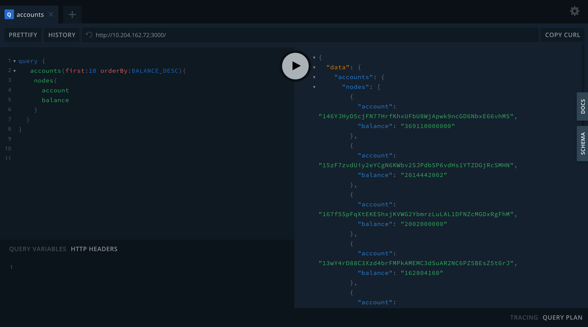
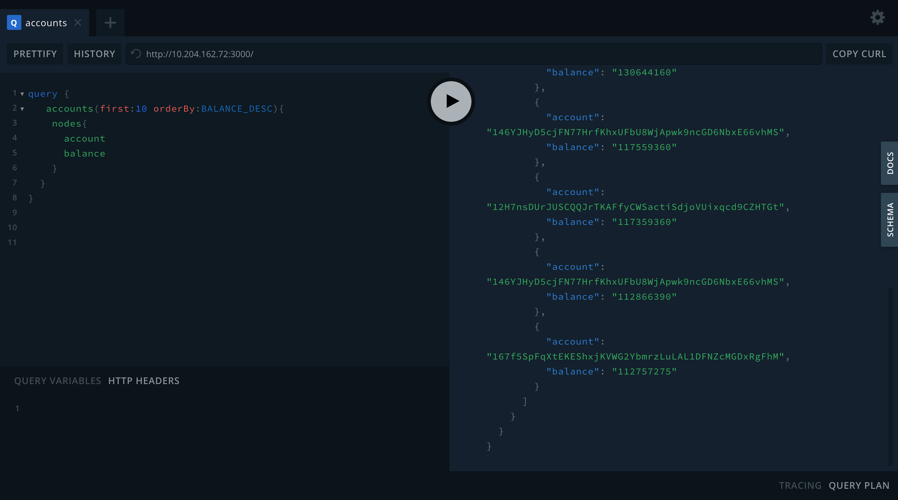

# What is SubQuery?

SubQuery powers the next generation of Polkadot dApps by allowing developers to extract, transform and query blockchain data in real time using GraphQL. In addition to this, SubQuery provides production quality hosting infrastructure to run these projects in.

# SubQuery Example - Account balance

This subquery example indexes the deposit balance of each account and it is an example of an EventHandler. By processing substrate events with the use of the "balances/Deposit" mapping filter, we can obtain account and the DOT balance of the account.

# Getting Started

### 1. Clone the entire subql-example repository

```shell
git clone https://github.com/subquery/tutorials-account-balances.git

```

### 2. Install dependencies

```shell
cd tutorials-account-balance
yarn
```

### 3. Generate types

```shell
yarn codegen
```

### 4. Build the project

```shell
yarn build
```

### 5. Start Docker

```shell
docker-compose pull & docker-compose up
```

### 6. Run locally

Open http://localhost:3000/ on your browser

### 7. The 1st example query to run

```shell
query {
   accounts(first:10 orderBy:BALANCE_DESC){
    nodes{
      account
      balance
    }
  }
}
```
### 8. The output generated by running of the query from the 1st example



### 9. The 2nd example query to run
```shell
query {
   accounts(last:3 orderBy:BALANCE_DESC){
    nodes{
      account
      balance
    }
  }
}
```
### 10. The output generated by running of the query from the 2nd example


# Understanding this project

This project has a function called handleEvent. It uses an [EventHandler](https://doc.subquery.network/create/mapping#event-handler) which is defined in the [manifest file](https://doc.subquery.network/create/manifest.html) (project.yaml) as "kind: substrate/EventHandler"

The [schema.graphql](https://doc.subquery.network/create/graphql.html) file defines the variables blockHeight which is mandatory and of type Int.

If we examine the function handleEvebt in more detail, you can see that this function takes one argument of type SubstrateEvent. It then creates a new instance of Account passing in the event.extrinsic.block.block.header.hash argument as a string and assigning this to the variable record.

Next, the account is converted to a string via toString() and assigned to record.account. The balance is type cast as Balance and converted to a big integer.
